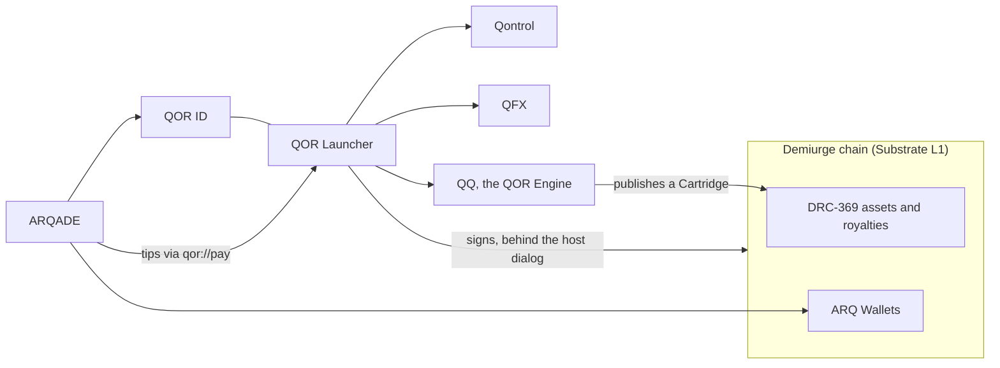

<div align="center">

# Demiurge

**A purpose-built chain for creators, and the platform on top of it.**
Makers earn when their work is used, licensed or remixed — on one sign-in, one asset format and one currency.

[](https://github.com/QOR-MATRIX/demiurge-chain/actions/workflows/ci.yml)
&nbsp;·&nbsp; Apache-2.0 &nbsp;·&nbsp; Pre-release, unaudited, test value only

[Where work stands](HANDOFF.md) · [Roadmap](docs/DIRECTION.md) · [Decisions](docs/DECISIONS.md) ·
[The economic model](docs/economics/CGT.md) · [What the chain does](docs/protocol/PROTOCOL.md)

</div>

---

## What Demiurge is

Demiurge is a **Substrate layer 1 on the Polkadot SDK** whose currency is **CGT, the Creator God Token**, and a
family of products built on it: the **QOR Launcher** on the desktop, **QOR ID** for signing in everywhere, **ARQADE**
for games, and **QQ**, the QOR Engine, for building them. Every product shares the same four primitives:

| Primitive | What it is |
| --- | --- |
| **QOR ID** | One identity: a name, a key, levels and an avatar, used by every product and by other apps through OAuth 2.1 |
| **DRC-369** | One asset format: a creator's work pinned by fingerprint, with royalties, remix royalties and nesting enforced on chain |
| **CGT** | One currency, for spending: 18 decimals, every amount an integer number of Sparks |
| **Qontrol** | Version control for people who make things: git underneath, a creator's view on top |

## Live today, on test value

| Service | Where | What it does |
| --- | --- | --- |
| **Demiurge Devnet** | `wss://rpc.qorsync.dev` | Two validators and a public node; DRC-369 assets, royalties, ARQ Wallets (one payout account per game) |
| **QOR ID** | [id.qorsync.dev](https://id.qorsync.dev) | Sign-in by key or password, sign-in for other apps, levels and XP, avatars |
| **ARQADE** | [qor-arqade-tau.vercel.app](https://qor-arqade-tau.vercel.app) | Solo and multiplayer games, rankings, chat, devnet reads, tips approved in the launcher |
| **QOR Launcher** | `tools/qor-launcher/` (0.1.8, unsigned installer) | The vault, sending and minting, Inventory, the Market, Projects, the QFX backdrops, ARQADE in its own window, QQ's preview |

There is **no production network**, and nothing here should hold real value. The economic model is decided in
direction but not implemented: no issuance, treasury or transaction fee exists, because each needs a number that is
[still open](docs/economics/OPEN_QUESTIONS.md).

## The products



| Product | Status |
| --- | --- |
| **QOR Launcher** — the desktop home: vault, assets, market, projects | Built; signed installer and updates to come (L6) |
| **QOR ID** — one sign-in for everything | Live |
| **ARQADE** — games played with a QOR ID, collectibles as DRC-369 assets | Live on the devnet |
| **QQ, the QOR Engine** — virtual worlds on Qt 6, with an agent that designs and builds ([ADR-083](docs/decisions/ADR-083-qq-on-qt.md)) | Started on Qt 6.12: QQ Studio renders a lit 3D world with a runtime-loaded model; a 2D preview runs in the launcher meanwhile |
| **Qontrol** — versioning for creators | Built in the launcher |
| **QFX** — the launcher's living visual layer | Six backdrops built |
| **GNOSIS**, **Stream**, **Market and Library** | Planned ([roadmap](docs/DIRECTION.md)) |

## Repository map

| Path | What it is | Status |
| --- | --- | --- |
| [`chain/`](chain/README.md) | The chain: runtime, node, and `pallet-validator-set`, `pallet-drc369`, `pallet-drc369-royalties`, `pallet-arq-wallet` (ADR-013, ADR-032) | Active |
| `services/qor-auth/` | QOR ID (Rust, Axum, Postgres, Redis) | Active |
| `tools/qor-launcher/` | The QOR Launcher (Tauri 2, Rust host, React) | Active |
| `products/arqade/` | ARQADE (Next.js on Vercel) and its developer SDK (ADR-069, ADR-074) | Active |
| [`products/qq/`](products/qq/README.md) | QQ on Qt 6 (ADR-083): the runtime module, QQ Studio and its render tests | Active, built on the owner's machine |
| `apps/`, `cli/`, `sdk/`, `packages/`, `client/` | Clients built for the pre-realignment protocol | Frozen (D-011) |

## Running it

[`scripts/run-local-stack.md`](scripts/run-local-stack.md) covers a development node, two validators, QOR ID and the
launcher; [`chain/README.md`](chain/README.md) covers the chain on its own.

```bash
cd chain && cargo test --workspace          # the chain (never under SKIP_WASM_BUILD: it is not evidence)
cd tools/qor-launcher && npm run app:dev    # the launcher
cd products/arqade && npm test              # ARQADE
```

Every pull request runs the chain, QOR ID, the launcher with ten browser checks, ARQADE, coverage and a security scan
on GitHub Actions. Release gates are measured, not asserted: [`docs/GATES.toml`](docs/GATES.toml).

## Principles

- **Paid for use, not for holding.** Validators are paid for securing the chain, seeders for storing and serving,
  creators when their work is used. CGT's value is demand to spend it ([ADR-002](docs/decisions/ADR-002-value-from-spending.md)).
- **Only the vault signs.** No product, website or engine holds a key; every signature is approved in the launcher's
  own dialog.
- **The code is the truth.** Documents are checked against it; every decision is a dated record; nothing is marked
  done without evidence from a run.

## Security

The protocol has not been audited. **Do not open a public issue for a vulnerability**: [`SECURITY.md`](SECURITY.md)
says how to report one, and records the security track and the advisories being carried.

## Licence

**Apache-2.0** ([`LICENSE`](LICENSE)), set by the owner on 21 September 2026; the copyright line reads "Demiurge".
Several **frozen** packages still declare `MIT` or `ISC` in their own manifests (`cli/`, `packages/*`, `client/`,
`apps/guru/sophia-demo`, and the dead `aeons/` pallets); they predate the realignment, are left as published, and
reconciling them is open. QQ is built with Qt under the owner's commercial licence; anyone else building
`products/qq/` needs their own Qt licence ([ADR-083](docs/decisions/ADR-083-qq-on-qt.md)).
